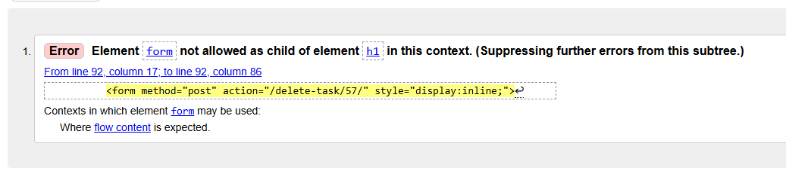

# Tasker Hub


Tasker Hub is platform designed for creativity, collaboration, and productivity.

Tasker Hub simplifies the process of exploring, creating, and sharing tasks within a vibrant community. With a clear purpose, mobile-friendly design, and intuitive navigation, it provides a seamless and user-friendly experience.

It facilitates connections by enabling the discovery of tasks, showing support through likes, and building on ideas by creating templates. Task management is streamlined with features to add, edit, or remove tasks, ensuring flexibility and control. A quick and secure sign-up process ensures smooth onboarding.

Tasker Hub transforms ideas into action, fostering collaboration and innovation.


## Table of Contents


- [Tasker Hub](#tasker-hub)
  * [User Experience (UX)](#user-experience-ux)
    + [User Stories](#user-stories)
      - [Planned User Stories](#agile-methodology)
      - [Agile Methodology](#agile-methodology)
    + [Design](#design)
      - [Colour Scheme](#colour-scheme)
      - [Imagery](#imagery)
      - [Fonts](#fonts)
      - [Wireframes](#wireframes)
  * [Data Model](#data-model)
  * [Testing](#testing)
  * [Deployment](#deployment)
  * [Technologies Used](#technologies-used)
    + [Languages](#languages)
    + [Frameworks, Libraries and Packages](#frameworks-libraries-and-packages)
    + [Tools](#tools)
  * [Frameworks - Libraries - Programs Used](#frameworks---libraries---programs-used)
  * [Credits](#credits)
  * [Acknowledgments](#acknowledgments)


## User Experience (UX)


Site user is an individual who values productivity, creativity, and collaboration, such as but not limited to task planners, project managers, and idea enthusiasts. 

[Live website](https://tasker-hub-fb8ebff24f35.herokuapp.com/)

### User Stories


#### Planned User Stories

- User Navigation
    - As a Site User I can:
        - see what the site is about so I can gain understanding of where I landed.
        - view the site on any screen size so that I can browse the site on all devices.
        - intuitively navigate around the site so that I can easily browse content.
        - locate social media links so that I can integrate into site's community.

- Task Lists Managment
    - As a Site User I can:
        - view paginated list of tasks so that I can select the preferred task. 
        - sort list of tasks so I can have easier time finding the preferred task.
        - click on a task so I can view the task.
        - add a new task so that I can create my own tasks as well.
        - highlight a task so that I can easily navigate to my current to do task.

- View Task Managment
    - As a Site User I can:
        - like other users tasks so that I can support their Tasker journey.
        - create templates from other user tasks so that I can expand on their idea.
        - edit my own task so that I can complete, correct or expand a main idea.
        - delete a task so that I can no longer see that task live on site.
        - save a task so that I can add a task to my tasks.

- Account Management
    - As a Site User I can:
        - sign up to the site so I can create my account.
        - sign in to the site so I can start using its features.
        - log out of my account so that I can keep my account secure.

- Site Administration
    - As a Superuser I can create, read, update and delete both tasks and users so that I can manage the site.

#### Agile Methodology

The project follows an Agile methodology, emphasizing a flexible and iterative approach to design and development.

GitHub Issues and Projects serve as the primary management tools. The project is divided into Epics, which represent larger, interconnected areas of the site. Each Epic is further broken down into User Stories, which are smaller, actionable tasks. These User Stories include detailed Acceptance Criteria—micro-steps that define the conditions for successful completion.

An up-to-date overview of the entire project is available on the [Project Managment Board](https://github.com/users/almost-good/projects/14).

To prioritize User Stories, the **MoSCoW Prioritization Technique** was applied:

- Must Have: Essential features guaranteed for delivery.
- Should Have: Important features that add significant value but are not vital.
- Could Have: Features with a minor impact if omitted.
- Won’t Have: Features not prioritized for the current iteration.


### Design

The design is straightforward, prioritizing clarity and ease of use. It ensures uniqueness and prevents conflicts, maintaining a smooth experience.

#### Colour Scheme


The overall color scheme embraces a soothing bluish tone, creating a calm and cohesive backdrop, while vivid bursts of bright red and yellow punctuate the design, injecting moments of vibrancy and lively contrast that draw the eye and energize the space.

#### Imagery

Images are primarily user-provided, with the exception of a warm, welcoming image of a notebook that gently encourages users to track their notes, and a thoughtfully included placeholder image to ensure users aren’t obligated to upload their own visuals.

#### Fonts

The website features a clean and modern typography palette, combining Open Sans for readability and versatility with the bold and structured elegance of Montserrat, creating a visually appealing and user-friendly design.

#### Wireframes

<details>

 <summary>Landing Page</summary>


</details>
<details>

 <summary>Browse Tasks</summary>


</details>
<details>

 <summary>View Task</summary>


</details>
<details>

 <summary>Your Tasks</summary>


</details>
<details>

 <summary>Add a New Task</summary>


</details>
<details>

 <summary>Register</summary>


</details>
<details>

 <summary>Log In</summary>


</details>


## Data Model


Entity Relationship Diagram (ERD) is created using [Database Diagram Tool](https://databasediagram.com/) to represent data models visually.

<details>

 <summary>Code used to create original model.</summary>

```
User
-
user_id Int PK
username Char(20)
email Char(50)
password Char(50)


Task
-
task_id Int PK
author Int FK > User.user_id
name Char(200)
is_completed Boolean
image Cloudinary
date_updated DateTime
likes Int

Subtask
-
subtask_id Int PK
task Int FK > Task.task_id
title Char(200)
note Text
is_completed Boolean
```
</details><br>

<details>

 <summary>Original ERD.</summary>


</details><br>

<details>

 <summary>Code used to create updated model.</summary>

```
User
-
user_id Int PK
username Char(20)
email Char(50)
password Char(50)

Task
-
task_id Int PK
author Int FK > User.user_id
name Char(100)
is_completed Boolean
task_image Cloudinary
date_updated DateTime
likes Int
slug Slug(200)

Subtask
-
subtask_id Int PK
task Int FK > Task.task_id
title Char(200)
note Text
is_completed Boolean
```
</details><br>


The database design for this project consists of the following models:

- **User** <br>
Represents the individual user. Sensitive information needed to succesfully access the account is stored here.
- **Task** <br>
Represents the individual task. Single Task is constructed from one or multiple subtasks and contains Foreign Key "author" effectively connecting User to Task. 
- **Subtask** <br>
Represents the individual subtask and contains all information needed to log a single subtask into a Task through "task" Foreign Key.

The initial database was designed during the early stages of project planning. However, it proved somewhat restrictive and was later updated to better accommodate and enhance the user experience.

## Testing

### Validation

#### HTML

[HTML W3C Validator](https://validator.w3.org/)
Each individual page was checked.

One error found.


#### CSS

[W3C CSS Validator ](https://jigsaw.w3.org/css-validator/validator?uri=https%3A%2F%2Ftasker-hub-fb8ebff24f35.herokuapp.com%2Fbrowse-tasks&profile=css3svg&usermedium=all&warning=1&vextwarning=&lang=en#warnings)


Warnings were related to the use of CSS variables for colors and fonts.

#### Python

[PEP8CI](https://pep8ci.herokuapp.com/#)
Minor indentation and comment irregularities.

### Bugs

- Application Error
  - Bug: The incorrect Procfile configuration prevented the webpage from being served, despite successful deployment.
  - Fix: Used the command "heroku logs --tail --app tasker-hub" to inspect the Heroku log files, which helped identify and resolve the misconfiguration in the Procfile.

- Like functionality
  - Doesn't work as intended.

## Lighthouse

- Home

- Browse

- Your Tasks

- Logout

- Task

- Edit Task

- Add Subtask

- Edit Subtask

- Add Subtask

- Signup

- Login


## Deployment

To get the Django framework installed and set up I followed the Code institutes Django Blog cheatsheet.

## Technologies Used


### Languages

- [Python 3.12.16](https://www.python.org/)
- [CSS3](https://developer.mozilla.org/en-US/docs/Web/CSS)
- [HTML5](https://developer.mozilla.org/en-US/docs/Glossary/HTML5)

### Frameworks, Libraries and Packages

- [Django 4.2.17](https://www.djangoproject.com/) - Main Python framework.
- [Gunicorn 20.1.0](https://gunicorn.org/) - WSGI server.
- [dj-database-url 2.3.0](https://pypi.org/project/dj-database-url/) - Utility to help load database into a dictionary from the DATABASE_URL environment variable.
- [psycopg2 2.9.10](https://pypi.org/project/psycopg2/) - Driver for interacting with PostgreSQL databases using Python.
- [django-summernote 0.8.20.0](https://github.com/lqez/django-summernote) - WYSIWYG text editor integrated into Django admin and forms for creating rich-text content.
- [whitenoise 5.3.0](https://whitenoise.readthedocs.io/en/latest/) - Utility that allows web apps to serve its own static files.
- [cloudinary 1.36.0](https://cloudinary.com/) - API for managing and serving images.
- [django-allauth 0.57.2](https://django-allauth.readthedocs.io/en/latest/) - User authentication.
- [django-crispy-forms 2.3](https://django-crispy-forms.readthedocs.io/en/latest/) - Enhanced form rendering.
- [Bootstrap5](https://getbootstrap.com/) - Frontend framework for responsive web development.
- [cripsy-bootstrap5] - Bootstrap 5 styling.

### Tools

- [Git](https://git-scm.com/) - Version control.
- [GitHub](https://github.com/) - Cloud-based hosting service.
- [VS Code](https://code.visualstudio.com/) - Source code editor.
- [Heroku](https://heroku.com/) - Cloud based platform for deployment.
- [PostgreSQL](https://www.postgresql.org/) - Open source database.
- [Cloudinary](https://cloudinary.com/) - Cloud based image managment.
- [Pencil](https://pencil.evolus.vn/) - Wireframes.
- [DateBase Diagram](https://databasediagram.com/) - Entity relationship diagram.
- [Font Awesome](https://fontawesome.com/) - Icons.
- [Google Fonts](https://fonts.google.com/) - Fonts.
- [Pexels](https://www.pexels.com/) - Free stock photos.
- [Coolors](https://coolors.co/) - Color scheme.
- [favicon.io](https://favicon.io/) - Favicon.
- [ChatGPT](https://chatgpt.com/) - Debugging steps.
- [Chrome DevTools](Chrome DevTools) - Debugging and development.

## Credits


## Acknowledgments

